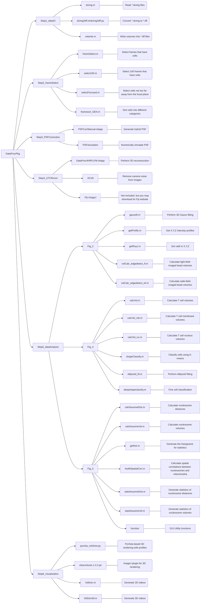

# LFC data processing package

## 1. File structure

## 2. Prerequisites

* MATLAB R2021+ [[1]](#ref1)

* Python 3.9+ (should work for 3.5+) [[2]](#ref2)

* CUDA 11.x [[3]](#ref3)

* Fiji ImageJ [[4]](#ref4)

  *The codes are ready to use without additional installation after all the software above is installed.*

## 3. How to proceed with sample data

### Step 1

The data conversion step [[5]](#ref5) is mainly for images taken from Hamamatsu cameras.

The included sample data have all be converted into 16-bit multipage TIFF files, which you can use Python packages (e.g., imageio, tifffile, etc) or the Matlab function `tiffreadVolume` to load them.

### Step 2

This step aims for removing frames with non-specific fluorescence. The programs in this folder open interactive dialogs with images sequentially. Choose frames with cells by clicking the image and press the `Enter` key if no cells appear in the frame. 

Optionally, you may want to select frames with cells that are not too far away from the focal plane using `selectFocused.m` based the some defocused features.

### Step 3

The numerical PSF was simulated with Min Gu's model [[6]](#ref6) for high-NA wide-field microscopes. You may start with `PostOBJ_gumin_standalone.py`, or load your previously simulated PSFs. Then use `air_cuda.py` and `convex.py` to perform further light-field propagation to get the light-field PSF. CUDA C++ is used on Nvidia devices, OpenCL is used on AMD devices, and CPU version is used for PCs with no GPU cards.

* Load both simulated light-field PSF and experimental light-field PSF in the Matlab APP `PSFCorrManual.mlapp`. 
* Set up the saving path. Set up "Fluorescence color" and "medium type inside the sample". Click `make folders` to make saving folders "PSFFLF[YYYYMMDD]corr[COL] [MED]" and  "PSFFLF[YYYYMMDD]finecorr[COL] [MED]".

> **Note 1** The simulated PSFs should be in **.mat** format and should be stored in a folder layer by layer separately. The experimental PSF should be in **.tif** format and should be stored in a folder layer by layer separately as well.

> **Note 2** The filename should be in a format of \<Latin letters\> + \<Arabic numbers\> + \<suffix\>. The \<Arabic numbers\> should be centered at <ins>50000</ins> (this matches the data acquired by MCL objective lens positioner).

* If the files are correctly recognized, you can see “50000” shown in the “Sim-Exp Frame No” label, two previews shown in the figure boxes and you can preview other images using “backward” and “forward” buttons.
* Use the two “Get 3 ROIs” to determine the positions of the three PSF points for both simulated and experimental PSFs.
* Use the “Show ROIs” button to see the selected ROIs.
* Use “Get Aligning Displacement” button for the first displacement estimation.
* Then use “Manual Aligning” to check the aligning status and adjust the PSFs manually. The “Decrease dX/dY” and “Increase dX/dY” buttons to make the adjustment. The selection radio buttons switch and determine which PSF spot is functioned. The table on the right side shows the displacement values. In this step, try to set the displacements on other layers as the layer at 50000. This ensures the continuing lateral displacement of the three PSF spots along the axial direction.
* Use “Export Vars” to export and save the “Offset” into .mat format.
* Start rough aligning first. The status will show the process.
* Then set the simulated PSF folder to "PSFFLF[YYYYMMDD]corr[COL] [MED]" and the “Fine Tune Resizing scale” to 10. 
* Get centroid and then use the “Fine tune” to check if the fine displacement looks good.
* Start fine aligning. The status will show the process.
* Then set the simulated PSF folder to "PSFFLF[YYYYMMDD]finecorr[COL] [MED]" and the “Fine Tune Resizing scale” to 100. 
* Get centroid again and then use the “Fine tune” to check if the fine displacement looks good.
* Start fine aligning again. The status will show the process.
* Set the Axial range and stack the calibrated hybrid PSFs into a single .mat file to the initial save folder for further reconstruction.

### Step 4

This package is for data preprocessing and LFM 3D reconstruction [[7]](#ref7). It is developed with Matlab 2020+.

* Use the “Open Directory” to point the program to a targeted folder.

#### >>> BKGsub - Background Subtraction

This section contains two methods of background subtraction:

-  Background subtraction by offset
-  Background subtraction by rolling ball algorithm with ImageJ-Matlab interface. 
   -  This is mainly for thick samples which have more background caused by out-of-focus structures.

#### >>> ACsN - Denoising Algorithm

* This is developed by Biagio Mandracchia, the postdoc in our lab ([More info about Biagio->](https://github.com/bmandracchia) / [More info about ACsN->](https://doi.org/10.1038/s41467-019-13841-8) / [More info about ACsN codes->](https://github.com/ShuJiaLab/ACsN)) for camera noising denoising [[8]](#ref8).

> Note this section will need parallel computing for computational acceleration.

#### >>> TR & CONV - Image Trim and Conversion

* The image trim is pixel-based and contains two modes:
  * With Circle Masks - only count the three elemental images.
  * Without Circle Masks - like normal image cropping

#### >>> RECON - 3D Reconstruction

- Use the “PSF File” button to specify the PSF path.
- Use the “FLFM File” button to specify the HR-FLFM raw image folder. If there are more than one images in the folder, the program will perform reconstructions for every image sequentially.
- Set the Iteration Number
- Use the “Reconstruction File” button to specify the folder location for saving the reconstructed results.
- There are four ways to perform reconstructions.
  - Use `Fit PSF Elemental Displacement` if `Hybrid with Ray Optics` or `Shifted Hybrid` modes were used.
  - For a good start, use  `Wave Optics Full GPU`, or `Wave Optics Conventional` if the GPU memory is not large enough.
    - Uncheck `Replace existing files` if you just want to continue a previous process.

- Click the “RL Deconvolution” button to start the reconstruction process. The status bar at the bottom will show the status and will turn green when the process is completed.
- When the reconstruction is done, a dialog will pop up for ROI selection and cropping.

#### >>> DISP - Image Display

* Choose "Rainbow" as the colormap.
* Set "Start Index" and "End Index" for volume displaying with an axial range 
* The "Intensity Offset", "IntD left width" and "IntD right width" are used for adjust the colormap.
* Use cropping to set the field of view.
* Set up the scale bar parameters in meter and the scale bar position.
* Set up "Intensity gain" to just the image brightness
* Click "Display Stack 3D" for color-stack visualization

### Step 5

* Cell volumes were estimated using edge detection methods. Use "volCalc_edgedetect_*.m" for bead phantoms and `calcvol.m` for cell samples.
* The cell shapes were classified using ellipsoid fitting (Yury Petrov and Oculus VR [[9]](#ref9)) and K-means clustering. Adjust the cell type number until a good stable clustering is achieved. Once the cell morphologies were classified, we performed a more sophisticated shape classification by applying K-means clustering again on each sub-group.
* To perform analysis on the nucleus and mitochondria, use calcNusomeVol, calcNusomeDist, and `NuMiSpatialCorr` as indicated in [Section 1](#1. File structure).  `calcNusomeVol` opens a dialog for ImageJ-based 3D segmentation [[10]](#ref10). `NuMiSpatialCorr` opens a dialog for edge-detection-based target labeling.
* See the flow chart for the description for each analyzing 

### Step 6

* ImageJ package: ClearVolume 1.4.2
  * For those who have `'const float4 color'` OpenCL bugs in rendering volumes after installing the ClearVolume plugin via FijiImageJ update, here I included an updated jar, so you only need to replace the original .jar file after the installation in the path `<Fiji directory>/jars/clearvolume-1.4.2.jar`.
    Please don't forget to cite the original Github repository and paper： [https://github.com/ClearVolume/clearvolume](https://github.com/xwghua/clearvolume-folked-updated/blob/Patches/url) and **[ClearVolume – Open-source live 3D visualization for light sheet microscopy.](http://www.nature.com/nmeth/journal/v12/n6/full/nmeth.3372.html)** [[11]](#ref11)
* Python package: PyVista [[12]](#ref12)
  * Please follow the API here: https://docs.pyvista.org/version/stable/api/index.html.
* MATLAB 
  * **VidGen** concatenates and saves 2D videos.
  * **VidGen3D** performs 3D visualization with `viewer3d`, `volshow` and a self-written 3D image saving program `imshow3d`. 

## Reference

[1] https://www.mathworks.com/products/matlab.html

[2] https://www.python.org/

[3] https://developer.nvidia.com/cuda-toolkit

[4] https://imagej.net/software/fiji/

[5] https://github.com/lens-biophotonics/dcimg

[6] Gu, M. (2000). Advanced optical imaging theory (Vol. 75). Springer Science and Business Media.

[7] Hua, X., Liu, W., and Jia, S. (2021). High-resolution Fourier light-field microscopy for volumetric multi-color live-cell imaging. Optica, 8 (5), 614-620.

[8] Mandracchia, B., Hua, X., Guo, C., Son, J., Urner, T., and Jia, S. (2020). Fast and accurate sCMOS noise correction for fluorescence microscopy. Nature communications, 11(1), 94.

[9] Yury (2023). Ellipsoid fit (https://www.mathworks.com/matlabcentral/fileexchange/24693-ellipsoid-fit), MATLAB Central File Exchange. Retrieved April 15, 2023.

[10] Ollion, J., Cochennec, J., Loll, F., Escudé, C., and Boudier, T. (2013). TANGO: a generic tool for high-throughput 3D image analysis for studying nuclear organization. Bioinformatics, 29(14), 1840-1841.

[11] Royer, L. A., Weigert, M., Günther, U., Maghelli, N., Jug, F., Sbalzarini, I. F., and Myers, E. W. (2015). ClearVolume: open-source live 3D visualization for light-sheet microscopy. Nature methods, 12(6), 480-481.

[12] Sullivan, C., and Kaszynski, A. (2019). PyVista: 3D plotting and mesh analysis through a streamlined interface for the Visualization Toolkit (VTK). Journal of Open Source Software, 4(37), 1450.

